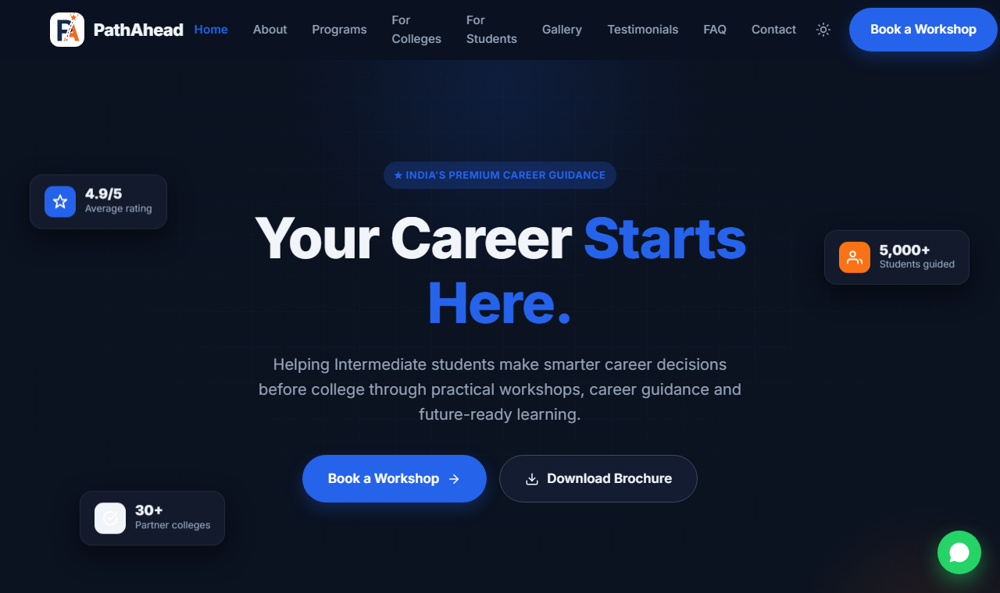
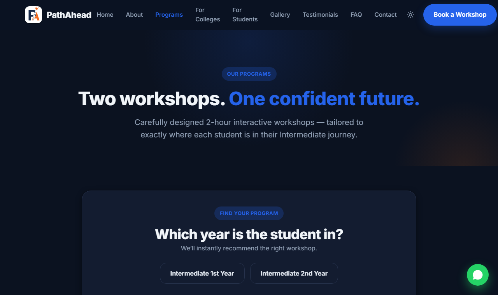
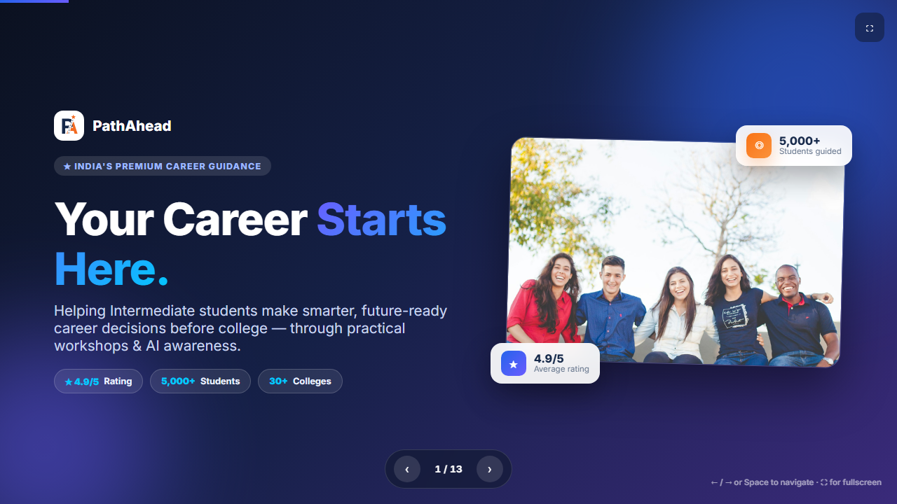

<div align="center">


# PathAhead

### *Your Career Starts Here.*

A premium, responsive, production-ready website for **PathAhead** — a career-guidance platform that runs career-awareness workshops for Intermediate (1st & 2nd year) students across India.

<br/>


</div>

<br/>

<div align="center">
  
</div>

---

## 📖 About

**PathAhead** helps students make smarter, future-ready career decisions *before* college — through practical, on-campus workshops covering career awareness, AI & technology, engineering branches and personalised career planning.

This repository contains the complete brand website **plus** a full promotional kit (presentation, brochure, tri-fold pamphlet and one-pager). It's a **zero-dependency static site** — pure HTML, CSS and vanilla JavaScript with **no build step and no frameworks** — that runs by opening `index.html` and deploys anywhere by uploading the folder.

---

## ✨ Features

| | |
|---|---|
| 🎨 **Premium, modern UI** | Apple / Stripe-inspired design, gradients, glassmorphism, soft shadows |
| 🌗 **Dark mode** | System-aware theme toggle that remembers your choice (no flash) |
| 📱 **Fully responsive** | Verified on mobile, tablet and desktop |
| 📝 **Working forms** | College inquiry, student registration, contact & newsletter — with validation |
| 📧 **Email delivery** | Every submission is emailed via **Web3Forms** |
| 🗄️ **Database + Admin** | Submissions stored in **Supabase**; a protected `/admin.html` dashboard with search & CSV export |
| ⚡ **PWA** | Installable, works offline (service worker + manifest) |
| 🔍 **SEO ready** | Per-page meta, Open Graph & Twitter cards, JSON-LD, sitemap, robots, custom 404 |
| ♿ **Accessible** | Semantic HTML, keyboard navigation, ARIA, reduced-motion support |
| 💬 **Extras** | Floating WhatsApp button, scroll animations, animated counters, accordion FAQ |

---

## 🖼️ Screenshots

<div align="center">

| Home | Programs |
|:---:|:---:|
|  |  |

**Presentation deck**



</div>

---

## 🛠️ Tech Stack

- **Frontend:** HTML5, CSS3 (custom design system with CSS variables), Vanilla JavaScript
- **Backend / Data:** [Supabase](https://supabase.com) (PostgreSQL + Row-Level Security + Auth)
- **Email:** [Web3Forms](https://web3forms.com)
- **PWA:** Web App Manifest + Service Worker
- **Fonts:** Inter · **No frameworks, no build tools**

---

## 📂 Project Structure

```
project_nirdhan/
├── index.html                 # Home
├── about.html  programs.html  for-colleges.html  for-students.html
├── gallery.html  testimonials.html  faq.html  contact.html
├── admin.html                 # Admin dashboard (Supabase Auth)
├── 404.html
├── css/styles.css             # Full design system + dark mode
├── js/
│   ├── main.js                # Shared nav/footer, interactions, form pipeline
│   ├── config.example.js      # Copy → config.js and add your keys
│   └── config.js              # Your keys (git-ignored, not committed)
├── assets/                    # Logo, icons, images, + promo kit ↓
│   ├── PathAhead-Deck.html         # Web presentation (16:9, navigable)
│   ├── PathAhead-Brochure.html     # Premium scrolling brochure
│   ├── PathAhead-Pamphlet.html/pdf # Print-ready tri-fold
│   └── PathAhead-OnePager.html     # One-page overview
├── manifest.webmanifest  sw.js  sitemap.xml  robots.txt  netlify.toml
├── SETUP.md                   # Full go-live guide (keys, DB, deploy)
└── README.md
```

---

## 🚀 Getting Started

```bash
# 1. Clone
git clone https://github.com/saatwik-1157/project_nirdhan.git
cd project_nirdhan

# 2. Add your keys (integration is optional — the site runs in demo mode without them)
cp js/config.example.js js/config.js      # then edit js/config.js

# 3. Run it — any static server works
python -m http.server 8000
#    → open http://localhost:8000
```

> Or simply **open `index.html`** in a browser — no server required.

---

## 🔧 Configuration

Integration keys are kept out of the repo for security. They live in **`js/config.js`** (git-ignored):

```js
window.PATHAHEAD_CONFIG = {
  web3formsKey:    "your-web3forms-key",   // https://web3forms.com
  supabaseUrl:     "https://xxxx.supabase.co",
  supabaseAnonKey: "your-anon-key"
};
```

Full instructions — Supabase tables & SQL, admin login, analytics — are in **[SETUP.md](SETUP.md)**.

---

## 🌐 Deployment

Any static host works (Netlify, Vercel, GitHub Pages):

1. **Netlify (easiest):** drag the project folder onto [app.netlify.com](https://app.netlify.com) → *Deploy manually*. A `netlify.toml` with security headers is included.
2. Update the domain in `js/config.js` → `siteUrl`, `sitemap.xml` and `robots.txt`.

> ℹ️ `config.js` is git-ignored, so include it in your deploy (drag-and-drop already does).

---

## 📎 Promotional Kit

Alongside the site, this repo ships a full marketing kit — all in `assets/`:

- 🎬 **Presentation** — `PathAhead-Deck.html` (fullscreen, arrow-key navigable)
- 📄 **Brochure** — `PathAhead-Brochure.html` (premium scrolling page)
- 📑 **Pamphlet** — `PathAhead-Pamphlet.html` + **`.pdf`** (print-ready tri-fold)
- 📃 **One-Pager** — `PathAhead-OnePager.html`

---

## 👥 Authors

Designed & developed by **two members**:

<table>
  <tr>
    <td align="center">
      <a href="https://github.com/saatwik-1157"><b>Saathwik</b></a><br/>
      <a href="https://github.com/saatwik-1157">@saatwik-1157</a>
    </td>
    <td align="center">
      <a href="https://github.com/Nirisha22"><b>Nirisha</b></a><br/>
      <a href="https://github.com/Nirisha22">@Nirisha22</a>
    </td>
  </tr>
</table>

---

## 📄 License

Released under the **MIT License** — see [LICENSE](LICENSE).

<div align="center">

**PathAhead — Your Career Starts Here.** ⭐

*If you find this project useful, consider giving it a star!*

</div>
